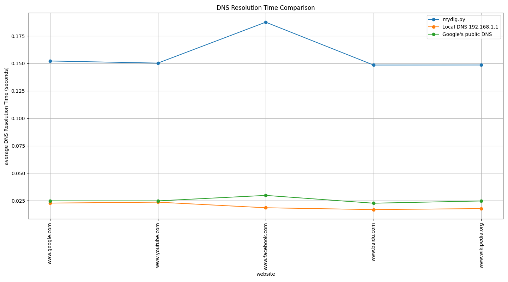

# Benchmark Results

The following benchmark compares the performance of three DNS resolution methods: `mydig.py`, a local DNS resolver, and Google's public DNS resolver `(8.8.8.8)`. The Alexa Top Sites list[1] was used to select the following five websites for testing:

```py
sites = [
    "https://www.google.com",
    "https://www.youtube.com",
    "https://www.facebook.com",
    "https://www.baidu.com",
    "https://www.wikipedia.org"
]
```

The following functions were performed:

1.  **mydig.py:** Each website was resolved 10 times using the custom `mydig.py` script.
2.  **Local DNS Resolver:** Each website was resolved 10 times using the system's local DNS resolver (192.168.1.1) via `dns.resolver.resolve()`. The `/etc/resolv.conf` file indicated that `fsl.cs.sunysb.edu` is the configured nameserver.
3.  **Google Public DNS:** Each website was resolved 10 times using Google's public DNS resolver (8.8.8.8) by configuring `dns.resolver.resolve()` to use this nameserver.

The results are summarized below:



The benchmark results demonstrate a clear performance difference between the three methods. The local DNS resolver exhibited the fastest resolution times, followed by Google Public DNS, with `mydig.py` showing the slowest performance.

*   **Local DNS Resolver (192.168.1.1):** The superior performance of the local DNS resolver is primarily attributed to DNS caching.  Repeated queries for the same domains are likely served from the local cache, resulting in significantly faster response times.
*   **Google Public DNS (8.8.8.8):** Google Public DNS performed better than `mydig.py` but was slower than the local resolver. The increased latency compared to the local resolver is likely due to network distance and the time required to transmit queries to and receive responses from Google's servers.
*   **mydig.py:** The relatively poor performance of `mydig.py` is likely because it starts resolution from the root servers for each query and does not implement caching. This necessitates a full DNS resolution process for every request, adding significant overhead.

Citations:
- [1] https://www.alexa.com/topsites
